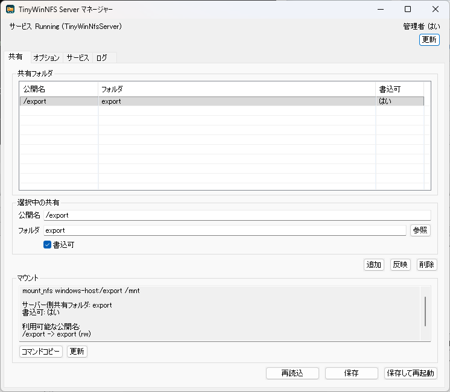

# TinyWinNFS Server

TinyWinNFS Server は、Java 21 で実装した Windows 向けのユーザー空間 NFS サーバーです。

QNX 4.25 を重要な検証対象にしていますが、製品自体は QNX 専用ではありません。Windows Client for NFS でも検証しています。

## 対応範囲

| 項目 | v1.14.0 の状態 |
|---|---|
| NFS | NFSv2 / NFSv3 |
| MOUNT | MOUNT v1-v3 |
| 認証 | AUTH_SYS |
| 通信方式 | UDP / TCP |
| 共有 | 複数 export、読み書き |
| ファイル操作 | 通常ファイル、ディレクトリ、rename、remove、mkdir、rmdir、link |
| symlink | `READLINK` / `SYMLINK` 対応。ただし Windows の symlink 作成権限とファイルシステム機能に依存 |
| NFSv3互換情報 | `FSINFO` / `FSSTAT` / `PATHCONF` の主要値を設定・Windows容量情報から応答 |
| 運用診断 | export状態、設定警告、大文字小文字衝突、環境・サービス情報を診断パッケージに出力 |
| 管理ツール | 診断ビュー、サーバーログ検索、設定インポート/エクスポート、クライアント別mount支援 |
| 性能/負荷検証 | ローカルRPCベンチマーク、長時間負荷ループ、大量READDIR回帰テスト |
| 検証対象 | QNX 4.25: NFSv2/UDP、Windows Client for NFS: NFSv3/UDP と NFSv3/TCP、Linux/WSL: 任意回帰 |
| 互換性回帰 | NFSエラー応答、属性応答、複数クライアント相当の相互編集、Windows NFS検証マトリクス、export境界検証 |
| 正式版候補文書 | サポート範囲、設定互換性、セキュリティ、インストール/更新/アンインストール |
| 対応外 | NFSv3 `MKNOD` などの特殊デバイスノード作成、NLM/file locking、NFSv4 |

## 画面



## インストール後の配置

v1.7.1 以降、アプリ本体と可変データを分離しています。

| 種別 | パス |
|---|---|
| アプリ本体 | `C:\Program Files\EnterOgawa\TinyWinNFS Server` |
| 設定ファイル | `C:\ProgramData\EnterOgawa\TinyWinNFS Server\conf\nfs-server.properties` |
| 既定 export | `C:\ProgramData\EnterOgawa\TinyWinNFS Server\export` |
| TinyWinNFS ログ | `C:\ProgramData\EnterOgawa\TinyWinNFS Server\logs\nfs-server.log` |
| 設定バックアップ | `C:\ProgramData\EnterOgawa\TinyWinNFS Server\conf\backups` |
| 診断パッケージ | `C:\ProgramData\EnterOgawa\TinyWinNFS Server\diagnostics` |
| WinSW サービスログ | `C:\Program Files\EnterOgawa\TinyWinNFS Server\service\winsw` |
| 同梱デフォルト設定 | `C:\Program Files\EnterOgawa\TinyWinNFS Server\defaults\conf` |

旧バージョンの `C:\Program Files\EnterOgawa\TinyWinNFS Server\conf\nfs-server.properties` が存在し、かつ `ProgramData` 側の設定がまだない場合は、初回インストール/起動時に `ProgramData` 側へ移行します。
設定保存時と旧設定移行時には、既存設定を `conf\backups` 配下へ最大 10 世代保存します。

## クイックスタート

### Eclipse

このフォルダを既存ワークスペースへ `Existing Projects into Workspace` で取り込みます。

Eclipse では JavaSE-21 の実行環境を設定してください。

### コンパイル

```powershell
.\scripts\compile.ps1
```

### 単体テスト

```powershell
.\scripts\test.ps1
```

### ローカルRPCベンチマーク

ネットワークポートやWindowsサービスを使わず、NFSv2手続きをプロセス内で呼び出して、作成、書込、LOOKUP、READDIR、rename、削除を測定します。

```powershell
.\scripts\benchmark-local-rpc.ps1 -Files 1000 -Directories 10 -Depth 1
```

結果は `work\analysis\v1.12.0-benchmark` に Markdown と CSV で保存します。

### Windows Client for NFS 検証

Windows 標準 NFS クライアントで UDP/TCP をまとめて確認します。

```powershell
.\scripts\test-windows-nfs-client-matrix.ps1
```

結果は `work\analysis\windows-nfs-client-matrix` に Markdown で保存します。Windows の `mount.exe` は portable な NFS version option を公開していないため、サーバーログで MOUNT v3 / NFSv3 RPC を確認します。

### 管理ツール作成

```powershell
.\scripts\package-manager.ps1
```

生成先:

```text
dist\TinyWinNfsManager
```

### インストーラー作成

```powershell
.\scripts\package-installer.ps1
```

生成先:

```text
dist\installer\TinyWinNfsSetup.exe
```

## Windows サービス

サービス化手順は [docs/windows_service.md](docs/windows_service.md) を参照してください。

インストーラーでサービスをインストールした場合、`TinyWinNfsServer` として登録されます。

| 項目 | 値 |
|---|---|
| サービス ID | `TinyWinNfsServer` |
| 旧サービス ID | `OgawaNfsServer`, `QnxNfsServer` |
| Portmap | UDP/TCP `111` |
| NFS | UDP/TCP `2049` |
| MOUNT | UDP/TCP `20048` |

UDP/TCP `111` と `2049` を利用するため、実行時は管理者権限と Windows ファイアウォールの許可が必要です。

## 管理ツール

ダブルクリック用の管理ツールは SWT で実装しています。SWT は Eclipse 2025-03 付属の `org.eclipse.swt.win32.win32.x86_64` jar を同梱します。

インストール後のスタートメニュー/デスクトップショートカットは `TinyWinNfsManager.exe` を直接起動します。インストーラーは Windows の `RUNASADMIN` 互換設定を登録するため、UAC 経由で管理者起動されます。

UI は英語と日本語に対応しています。

| 設定 | 値 |
|---|---|
| 自動判定 | `ui.language=auto` |
| 英語 | `ui.language=en` |
| 日本語 | `ui.language=ja` |

## 設定ファイル

通常は管理ツールから編集します。直接編集する場合は以下のファイルを変更し、サービスを再起動してください。

```text
C:\ProgramData\EnterOgawa\TinyWinNFS Server\conf\nfs-server.properties
```

### 共有設定

複数 export は `exports.count` と `exports.N.*` で定義します。`export.*` は先頭共有との互換用です。

| キー | 既定値 | 説明 |
|---|---|---|
| `exports.count` | `1` | 共有定義数 |
| `exports.N.name` | `/export` | NFS クライアントから見える export 名。`/` で始める |
| `exports.N.path` | `export` | Windows 側共有フォルダ。相対パスはデータルート基準 |
| `exports.N.writable` | `true` | `true`: 書込可、`false`: 読込専用 |
| `exports.N.allowed.clients` | 空欄 | 許可する IPv4 アドレスのカンマ区切り。空欄なら全クライアント許可 |

例:

```properties
exports.count=2
exports.1.name=/export
exports.1.path=export
exports.1.writable=true
exports.1.allowed.clients=
exports.2.name=/readonly
exports.2.path=C:\\data\\readonly
exports.2.writable=false
exports.2.allowed.clients=192.168.1.30
```

### ネットワーク設定

| キー | 既定値 | 説明 |
|---|---|---|
| `portmap.port` | `111` | Portmap の UDP/TCP ポート |
| `nfs.port` | `2049` | NFS の UDP/TCP ポート |
| `mount.port` | `20048` | MOUNT の UDP/TCP ポート |
| `rpc.udp.workers` | `8` | UDP RPC 要求を処理するワーカー数 |
| `rpc.udp.queue.size` | `1024` | UDP RPC ワーカーへ渡す待ち行列サイズ |
| `rpc.tcp.timeout.millis` | `30000` | TCP RPC クライアント接続の読み取りタイムアウト |
| `client.server.host` | `windows-host` | 管理ツールが表示する mount コマンド用のホスト名 |
| `client.mount.point` | `/mnt` | 管理ツールが表示する mount コマンド用のクライアント側マウント先 |
| `client.mount.profile` | `0` | 管理ツールの mount 表示。`0`: QNX、`1`: Windows Client for NFS、`2`: Linux/WSL |
| `client.mount.protocol` | `0` | 管理ツールの protocol 表示。`0`: NFSv2 UDP、`1`: NFSv3 UDP、`2`: NFSv3 TCP |

### 権限/属性設定

| キー | 既定値 | 説明 |
|---|---|---|
| `permission.identity` | `auto` | `auto`: AUTH_SYS の UID/GID を属性応答に反映、`fixed`: `uid` / `gid` を固定返却 |
| `uid` | `0` | `permission.identity=fixed` 時の UID |
| `gid` | `0` | `permission.identity=fixed` 時の GID |
| `file.mode` | `0644` | 通常ファイルの mode |
| `directory.mode` | `0755` | ディレクトリの mode |
| `block.size` | `4096` | 属性/FS 情報で返すブロックサイズ |
| `read.size` | `8192` | NFS READ の最大応答サイズ |
| `write.size` | `8192` | NFSv3 `FSINFO` で返す write 最大/推奨サイズ |
| `directory.preferred.size` | `4096` | NFSv3 `FSINFO` で返すディレクトリ推奨読込サイズ |
| `max.file.size` | `9223372036854775807` | NFSv3 `FSINFO` で返す最大ファイルサイズ |
| `time.delta.nanos` | `1000000` | NFSv3 `FSINFO` で返す時刻精度ナノ秒 |
| `pathconf.link.max` | `1024` | NFSv3 `PATHCONF` で返す link 最大値 |
| `pathconf.name.max` | `255` | NFSv3 `PATHCONF` で返すファイル名最大バイト数 |
| `filename.charset` | `UTF-8` | NFSv2 ファイル名/リンクパス文字列の文字コード。Java の Charset 名を指定 |

### 性能設定

| キー | 既定値 | 説明 |
|---|---|---|
| `write.sync` | `false` | `false`: WRITE 応答前の物理同期を省略して性能優先、`true`: 各 WRITE を同期 |
| `write.cache.enabled` | `true` | 書込ファイルキャッシュの有効化 |
| `write.cache.max.open` | `64` | 書込キャッシュで保持する最大オープン数 |
| `write.cache.idle.millis` | `3000` | アイドル状態の書込ファイルを保持する時間 |

性能設定の調整時は、通常の単体テストに加えて [docs/performance_testing.md](docs/performance_testing.md) のローカルRPCベンチマークを実行してください。

## マウント例

QNX 4.25:

```text
mount_nfs windows-host:/export /mnt
```

Windows Client for NFS:

```powershell
mount -o anon \\127.0.0.1\export Z:
```

詳細手順:

| 対象 | ドキュメント |
|---|---|
| QNX 4.25 | [docs/qnx425_mount.md](docs/qnx425_mount.md) |
| Windows Client for NFS | [docs/windows_nfs_client_test.md](docs/windows_nfs_client_test.md) |
| WSL/Linux | [docs/wsl_mount_test.md](docs/wsl_mount_test.md) |
| サポート範囲 | [docs/support_scope.md](docs/support_scope.md) |
| 設定互換性 | [docs/configuration_compatibility.md](docs/configuration_compatibility.md) |
| セキュリティとアクセス制限 | [docs/security_model.md](docs/security_model.md) |
| インストール/更新/アンインストール | [docs/install_upgrade_uninstall.md](docs/install_upgrade_uninstall.md) |
| NFS手続きカバレッジ | [docs/nfs_procedure_coverage.md](docs/nfs_procedure_coverage.md) |
| Windowsファイルシステム制約 | [docs/windows_filesystem_constraints.md](docs/windows_filesystem_constraints.md) |
| 性能/負荷確認 | [docs/performance_testing.md](docs/performance_testing.md) |

## テスト

| 目的 | コマンド |
|---|---|
| 単体テスト | `.\scripts\test.ps1` |
| サービス UDP スモークテスト | `.\scripts\smoke-service.ps1` |
| サービス TCP スモークテスト | `.\scripts\smoke-service.ps1 -Transport TCP` |
| ファイル整合性確認 | `.\scripts\smoke-service.ps1 -VerifyFileIntegrity` |
| 大量ツリー整合性確認 | `.\scripts\smoke-service.ps1 -VerifyLargeTreeIntegrity` |
| 再起動後ハンドル確認 | `.\scripts\smoke-service.ps1 -RestartHandlePersistence` |
| Windows Client for NFS 結合テスト | `.\scripts\test-windows-nfs-client.ps1` |
| Windows Client for NFS TCP 結合テスト | `.\scripts\test-windows-nfs-client.ps1 -Transport TCP` |
| Windows Client for NFS UDP/TCP マトリクス | `.\scripts\test-windows-nfs-client-matrix.ps1` |
| Windows Client for NFS protocol 事前設定済み確認 | `.\scripts\test-windows-nfs-client.ps1 -Transport TCP -SkipProtocolChange` |
| Windows Client for NFS レポート指定 | `.\scripts\test-windows-nfs-client.ps1 -ReportPath work\analysis\windows-nfs-client\manual.md` |
| 長時間稼働確認 | `.\scripts\test-service-stability.ps1 -DurationMinutes 60 -IntervalSeconds 15 -RestartEveryIterations 10` |

このリポジトリでは環境依存を避けるため、サーバー起動を伴う確認は手動確認対象です。

## 互換性と制限事項

| 項目 | 説明 |
|---|---|
| 大文字小文字 | 通常のWindowsフォルダでは `File.h` と `file.h` は同一ファイル扱いです。QNXなど大文字小文字を区別する環境からコピーする場合は事前に衝突を確認してください |
| 予約文字 | Windowsで利用できない文字や予約名は、NFSクライアント側で作成できません |
| ファイル名長 | NFSv2/v3とWindowsの双方の上限に制限されます。`pathconf.name.max` はNFSv3応答値です |
| symlink | `READLINK` は Windows symlink のリンク先を返します。`SYMLINK` は Windows 側で symlink 作成が許可されている場合のみ実体として作成します |
| symlink 作成失敗 | 権限不足やファイルシステム非対応の場合は `ACCES` / `PERM` を返します。通常ファイルへのフォールバック作成は行いません |
| 壊れた symlink | `READLINK` でリンク先文字列を返しますが、リンク先の実体は保証しません |
| file locking | NLM/file locking は未実装です |
| NFSv4 | 未実装です |
| 特殊デバイス | NFSv3 `MKNOD` などの特殊デバイスノード作成は未対応です |

正式版に向けた詳細なサポート範囲と既知制限は [docs/support_scope.md](docs/support_scope.md) を参照してください。

## ライセンス

TinyWinNFS Server は Apache License 2.0 で提供します。

配布物に同梱する第三者コンポーネントのライセンスは [THIRD_PARTY_NOTICES.md](THIRD_PARTY_NOTICES.md) を参照してください。
